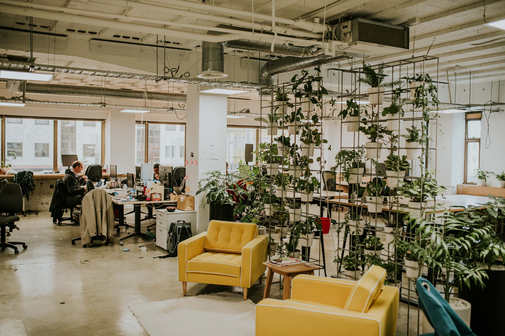
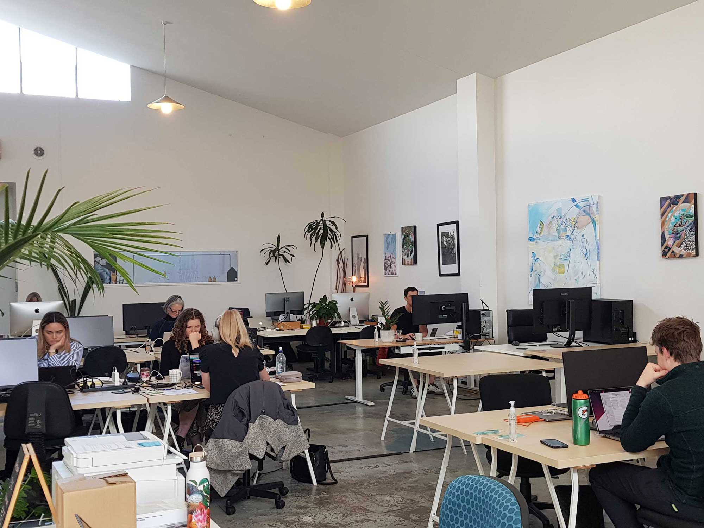
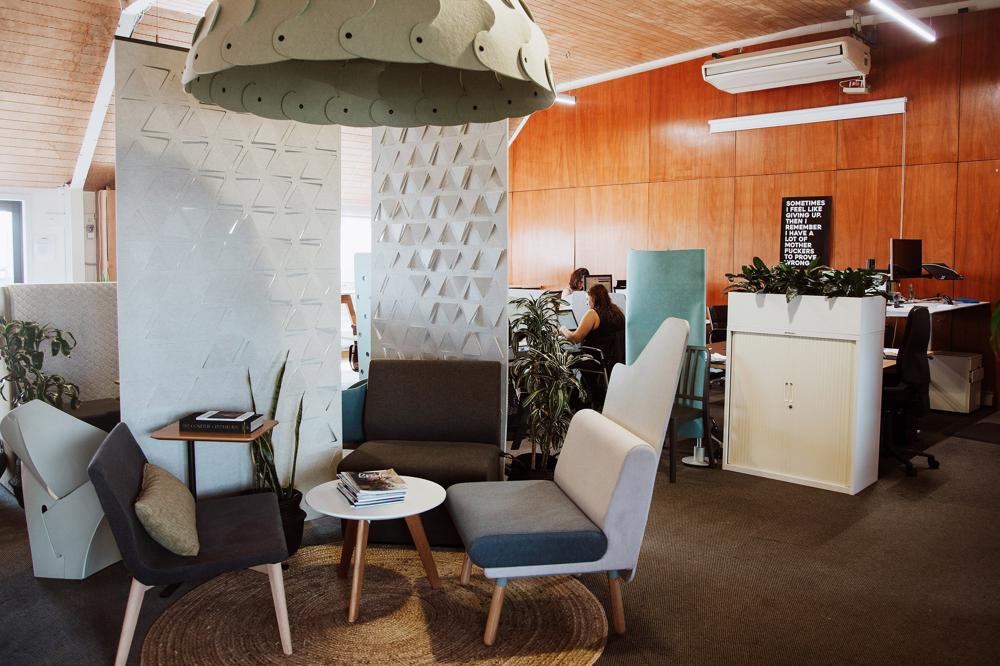
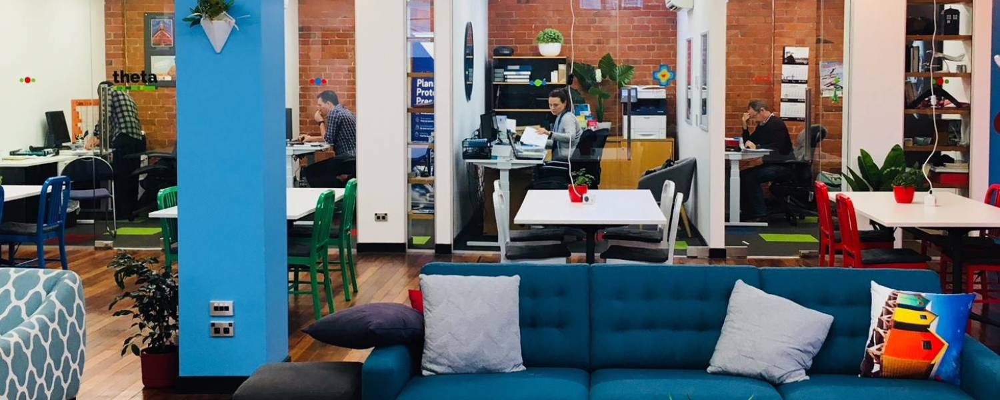
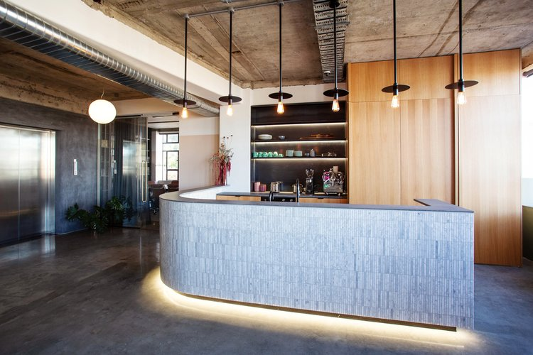

Thinking about making New Zealand a base for working remotely? It certainly has a lot to offer. While the country isnt exactly cheap, it makes up for it with the high standards of living, world class facilities and breathtaking views.

While recently spending some time in New Zealand, I curated this list of my favourite places to work remotely. I used the following criteria when determing not only if they should go on this list, but if they were suitable for my own use:

1. Price - they have to be affordable
2. Flexibility - the ability to work anywhere from 1 day, to a month.
3. Quality - a space which provides not only good value for money, but provides a good space to work in. 
4. Modern - A good modern co-working space allows for different modes of working e.g. collaborative, and quiet personal activities.

Working in a co-working space offers numerous advantages to remote workers/digital nomads. It provides networking opportunities by bringing professionals from various industries together, fostering collaboration and synergy. Co-working spaces offer flexibility and value for money, allowing individuals and businesses to choose membership plans that suit their needs and eliminating the need for setting up and maintaining a traditional office (all of my reccomendations below offer day passes as well as longer, more cost effective options). These spaces also provide access to amenities and infrastructure, saving you from the hassle of managing your own office. Co-working spaces also create a sense of community and support, offering opportunities for skill-sharing, emotional support, and personal development through events and workshops.

## [Wellington - Credenza](https://www.credenza.nz/)

Credenza is located in the heart of Wellington CBD, and its one of the few places that caters for casual day users. They offer a modern place to work without being too over the top with inclusions that you dont need, or want to pay for. They have hot desks, meeting rooms and private office spaces, covering off everything that you might need along with the flexibility that remote work requires.

## [Auckland - The workshop](https://www.theworkshopauckland.co.nz/)

With two locations in Auckland (Potsonby and Avondale) theres some flexibility available.

As with most of the co-working spaces that I have shared on this list, I personally used this space because they have the options of day pass, which can be hard to find in Auckland, with most co-working spaces only offering monthly prices which can be quite expensive. The price for a hot desk start from $39 per day - you have to book an actual desk space off a map. There are free street parking options available at both locations, at Potsonby you have to walk 10 minutes to get free street parking.

## [Christchurch - Genious CoWorking](https://www.geniuscoworking.co.nz/)

This an interesting place with its modern design and water front location in Ferrymead, its close to beaches, out of the city, and in a sophisticated yet older part of chirstchurch. It's a vibrant space, unlike a regular office. It definitely provides you with a break **from** the office, which is what everyone needs!

They have a range of flexible packages from day passes to unlimited access for a month.

## [Queenstown - Tikki Studio](https://www.tikkistudio.com/co-working-space)

These guys actually specialise in promoting sustainability in the fashion industry through repairing and upcycling clothing. Providing a co-working space is something that they do on the side, but I rate them as its a cool space (with sewing equipment included if you need it for a project), and they have a great mission.
Its 10 minutes from queenstown cbd, away from all the hustle and bustle. If you get the chance to go to Queenstown you will find out that the CBD is actually quite small and conjected with very little parking (and its very expensive). I highly reccomend planning to work **outside** of the CBD as chances are parking will not be available.

They offer day and week packages, along with the option of hiring the whole student for larger projects.

On a side note they also provide sewing courses for adults and children if that interests you!

## [Dunedin - Petridish Shared Office Space](https://petridish.co.nz/)
 

Petridish is another great space that I spent a few days working at. As with many co-working space in NZ, this one got my vote due to flexibility - they were happy for me to pay on a day-by-day basis. They also have a great coffee shop which was a bonus. They have quiet desks, and a "noise friendly" community area where its ok to have a chat or take long phone calls. The ambience is great and the staff are very friendly. 

## [Hamilton - Panama co-working spaces](https://www.panama.co.nz/)

They offer a modern facility with all of the basics that you need and lots of different seating options so you can change it up throughout the day. While they have four locations, only the Panama Square location allows to to drop in with a day-pass. Monthly customers also get access to yoga classes and other extras, though I was only there for a couple of days so I can't vouch for those free extras.

## Need more ideas?

[The co-working collection](https://safetywing.com/perks/?referenceID=24741702&utm_source=24741702&utm_medium=Ambassador) is a curated list of co-working spaces all around the world. If you need some help finding a great place to do some work in an out of the way place, its a great place to start. Great News! They also offer discounts if your a [Safety Wings Nomad Health Insurance Customer](https://safetywing.com/?referenceID=24741702&utm_source=24741702&utm_medium=Ambassador). They are my go-to for insurance while on the road. I like them because the prices are competitive, the features are great, but they don't cover you for things that you don't need. For me, it works out to be a much better deal than getting travel insurance, and the service is much more like what I get from Health insurance back home. 

## Conclusion

What are you waiting for? There are so many great spaces out there that you can utilise for getting your 9-5 work done. Why stay at home when you can roam around the world and take in its sights and smells. Happy Travelling!
