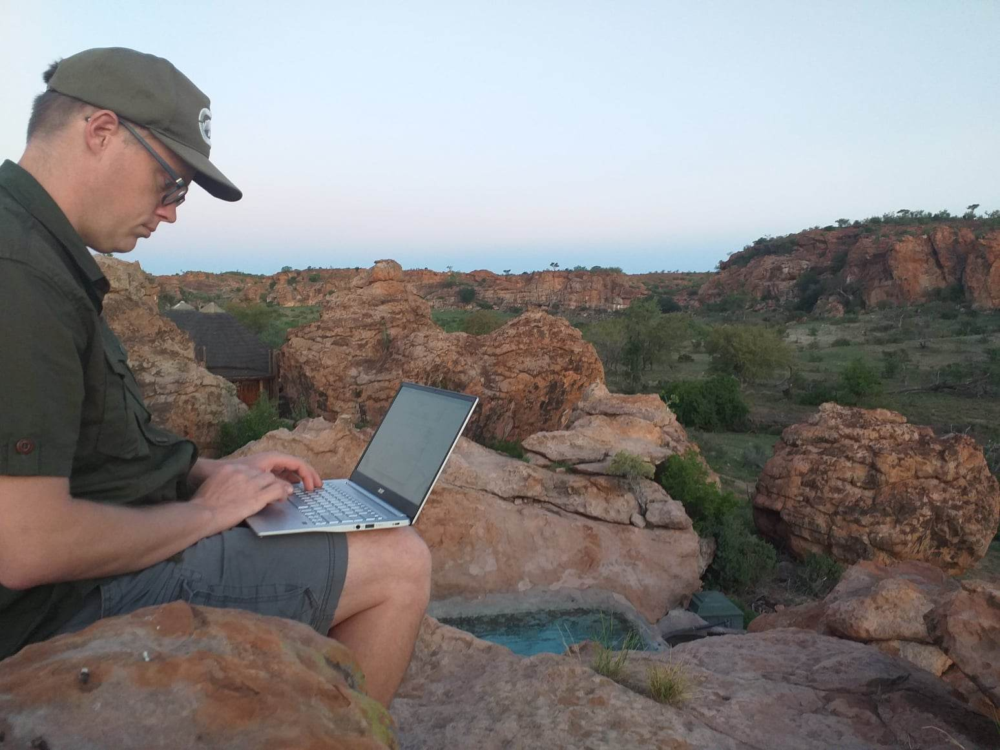
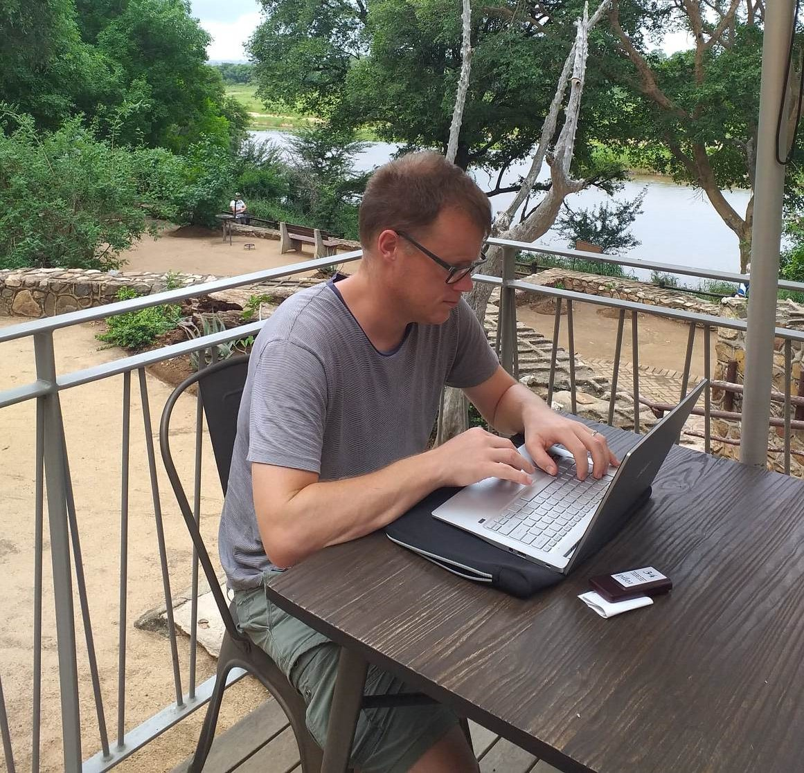

The digital nomad lifestyle has become increasingly popular in recent years, particularly for software developers who can work remotely from anywhere in the world. While the freedom and flexibility of this lifestyle can be appealing, there are also a number of pros and cons to consider before you take the plunge.

In this post, I will look at the benefits and drawbacks of the digital nomad life for software developers, including the advantages and disadvantages of remote work and freelancing, the benefits of being a digital nomad, health insurance, and the potential drawbacks of working from anywhere.

## Remote Work Pros and Cons

Remote work has become increasingly popular in recent years, particularly in the tech industry. For software developers, the ability to work from anywhere in the world can be a huge advantage. Remote work can allow for a better work-life balance, reduced commute time and costs, and increased productivity. I personally save on average 1 hour per day by not driving or taking the train. 

That said, there are also some potential downsides to consider, such as the lack of face-to-face interaction with colleagues, potential communication difficulties, slow internet connections in developing countries, and the need for a self-disciplined approach to work. Some jobs require you to come into the office one day per week, or you may enjoy working a a co-working space for a few days a week to give you a chance to interact with others while working.

## Freelancing Advantages and Disadvantages

One of the first things that developers do when they have trouble finding a job which allows the flexibility of working remotely is becoming a freelancer (working for yourself) - providing services such as web development, app design, and software engineering. Freelancing can provide a flexible schedule and the ability to work on a variety of projects, but it can also come with its own set of challenges. 

Freelancers need to find their own clients and manage their own workload, which can be stressful, expensive and time-consuming. Additionally, there is no guarantee of steady work or income. One option is to get the best of both worlds - work part time for an employer (hopefully remotely!) and spend the other half of your time working for yourself as a freelancer. This provides you with some stability of income, should your freelance work start to dry up. I personally find the hardest part of freelancing is finding new clients. A business model which allows for repeat business is defeinitely a plus.

## Digital Nomad Benefits

For me, the biggest advantage to being a digital nomad is the ability to work and travel at the same time! Digital nomads can work from anywhere in the world, whether it's a coffee shop on the beach in Bali or a futuristic co-working space in Europe. This lifestyle can provide a sense of adventure and the opportunity to experience new cultures and ways of life. While working alone can be daunting, digital nomads often have a strong sense of community, connecting with like-minded individuals through social media groups and online forums.

## Work from Anywhere Drawbacks

While working from wherever you like can be a big advantage, there are also potential drawbacks to consider. One of the biggest challenges is the potential for distractions. When working in a new and exciting environment, it can be difficult to focus on work and avoid the temptation to explore your surroundings, or be distracted from work with conversations with new people that you meet. In many locations it can be hard to find a reliable internet connection. You don't really know how the internet at your accommodation will work until you arrive. Additionally, working in different time zones can be challenging, particularly when it comes to scheduling meetings and communicating with clients in your home country, should you be a long distance East or West from your job's location.

## Travel Medical Insurance

While it sounds so tempting to dive right in, it is important for digital nomads to consider the potential cost of health care while working on the road. Travel medical insurance can provide peace of mind and financial protection in the event of an unexpected illness or injury. Travel insurance can be very expensive, and contain many limitation. Over my many years of freelancing remotely I have researched and actually used many of the front runners who provide insurance which is tailored for use by digital nomads.

My go to choice is SafetyWing - is a travel medical insurance that was created by nomads for nomads. They are competitively priced as they only offer insurance for the things you need - no fancy add ons. You can purchase a policy even if your trip has already started, and pause and resume coverage with flexibility. You’re covered in 185 countries and you don’t need to let them know about your itinerary in advance. Perfect for people like me who don’t know where they’ll be next month! [Check out their website here](https://safetywing.com/?referenceID=24741702&utm_source=24741702&utm_medium=Ambassador). Please consider using my link as if you choose to go ahead with them (you most likely will!) using my link will help support this site.

## Conclusion

The digital nomad lifestyle can be a great choice for software developers who value freedom and flexibility. However, it's important to consider the potential pros and cons before taking the plunge. By understanding the advantages and disadvantages of remote work and freelancing, the benefits of being a digital nomad, and the potential drawbacks of working from anywhere, you can make an informed decision about whether the digital nomad lifestyle is right for you.
